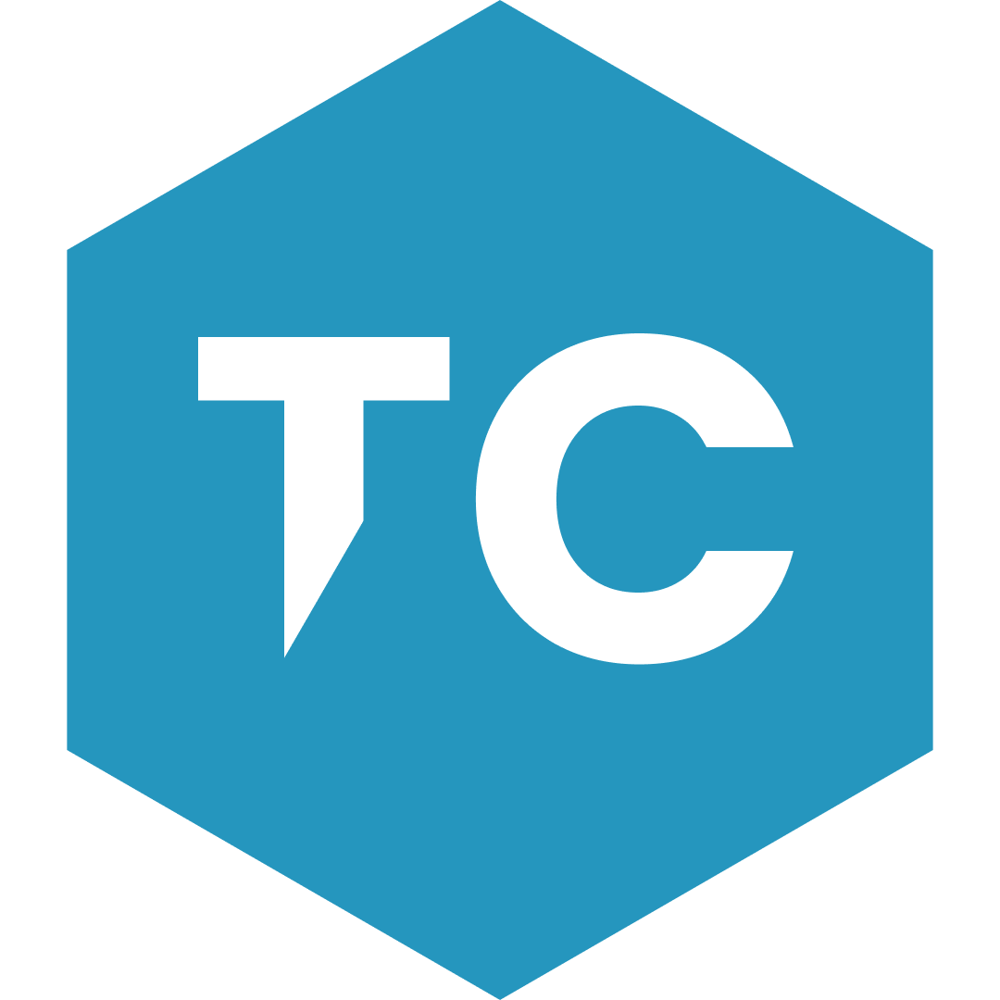

# Techurve

---

## Who are we

> we are a company improving people's businesses with `SaaS` :shipit:

## Open Source Projects

- [flutter_sanity_image_url](https://github.com/techurve/flutter_sanity_image_url)

## Tech Stack & Tools

## Contact

- [email](mailto:contact@techurve.nl)
- [website](https://techurve.nl)
- [linkedin](https://linkdin.com/techurv3)

---
